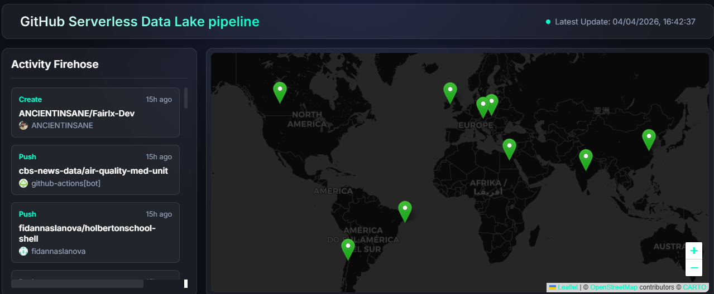
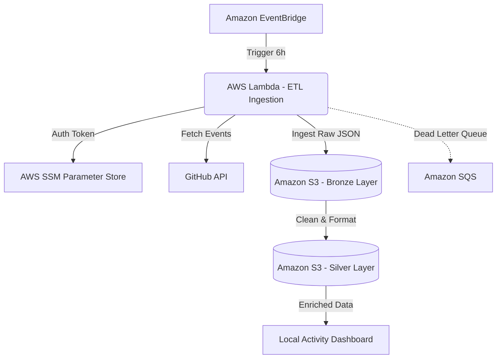

# Serverless Data Pipeline & GitHub Analytics Dashboard



## Project Overview
This project establishes an End-to-End Serverless Data Engineering pipeline fully hosted on AWS using the **Always Free Tier**. It automates the extraction of raw events from the public GitHub API, ingests them into a Data Lake (Amazon S3), and visualizes the global activity on a Dashboard.

All underlying backend infrastructure is thoroughly managed using **Terraform**.

## Architecture



### 1. Ingestion Layer (Bronze)
1. **Trigger (Amazon EventBridge):** Functions as the pipeline scheduler (equivalent to an Airflow DAG schedule), dispatching events every 6 hours automatically.
2. **Compute (AWS Lambda):** Executes a lightweight Python container to pull data, validate schemas with Pydantic, and write to storage. 
3. **Secrets (AWS SSM Parameter Store):** Securely stores the GitHub Bearer Token. Credentials are NEVER hardcoded in the repository.
4. **Resiliency (Amazon SQS):** A Dead Letter Queue (DLQ) captures execution payloads if the Lambda function fails repeatedly. Messages are kept for 14 days, preventing any data loss during unexpected crashes.
5. **Storage (Amazon S3):** Retains raw JSON files separated natively using Hive partitioning structures (`year=YYYY/month=MM/day=DD/`). An explicit Lifecycle configuration automatically deletes objects older than 3 days, remaining comfortably within the Free Tier.

### 2. Serving Layer & Visualization
The processed and enriched data feed a custom analytics dashboard that can be easily viewed locally. While this dashboard could be completely hosted and distributed globally via AWS (e.g., using S3 Static Hosting and CloudFront), we elected to run it locally to keep the project scope focused on core Data Engineering concepts rather than deep frontend web hosting infrastructure.

## Dataset Structure (GitHub Firehose)

The pipeline extracts events from GitHub's public telemetry. Each raw JSON document logged in the Bronze Lake represents a single action performed on an open-source repository at that exact millisecond. 

Below is the dictionary structure of the ingested data:

*   **`id`**: Unique global event identifier.
*   **`type`**: The action performed. Common types include `PushEvent` (code pushed), `CreateEvent` (branch/repo created), and `WatchEvent` (repository starred).
*   **`actor`**: Identifies the user or bot (e.g., `dependabot[bot]`) that triggered the event, alongside their geographic location, avatar URL, and unique ID.
*   **`repo`**: The exact repository where the action happened (e.g., `aaxlss/CRM-Predictions`). This is the core variable for aggregating trending projects.
*   **`payload`**: Varies heavily depending on the `type`. For a `PushEvent`, it contains the `ref` (branch name) and the `head` (exact commit hash).
*   **`created_at`**: The global UTC timestamp of when the event landed on GitHub.

## Tech Stack
*   **Infrastructure as Code (IaC):** Terraform
*   **Backend:** Python 3.12, AWS Lambda, Amazon EventBridge, Amazon SQS, Amazon S3, AWS SSM Parameter Store
*   **Libraries (Python):** `boto3` (AWS SDK), `requests` (API Interaction), `pydantic` (Data Validation and Schema Enforcement)

 
## Security Standards
*   **IAM Least Privilege Enforcement:** Explicit Terraform policies block broad behaviors. The role limits actions rigidly based on resource ARNs (e.g., specific `PutObject` paths).
*   **S3 Public Access Blocks:** Bucket configurations explicitly prevent unauthorized web exposures.

## Setup - How to Deploy & Run

### 1. Requirements
*   AWS CLI authenticated.
*   Terraform `~> 5.0` installed.
*   Python 3.12+ (with `uv` installed).

### 2. Deploy Backend Infrastructure
Sync your dependencies and generate the required dependency layer for AWS Lambda, then apply the Terraform stack to register roles, functions, triggers, and queues.
```bash
uv sync
python scripts/build_layer.py
cd terraform
terraform init
terraform apply -auto-approve
```

You can test the Lambda extraction manually via AWS CLI:
```bash
aws lambda invoke --function-name etl_github_events_extractor execution_result.json
```

### 3. Run the Analytics Dashboard
To visualize the data, navigate to the dashboard directory and spin up a local Python server:
```bash
cd dashboard
python -m http.server 8000
```
Then, access **[http://localhost:8000/dashboard/](http://localhost:8000/dashboard/)** in your web browser.
